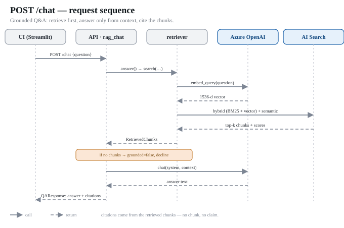
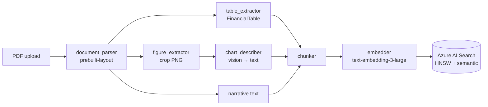
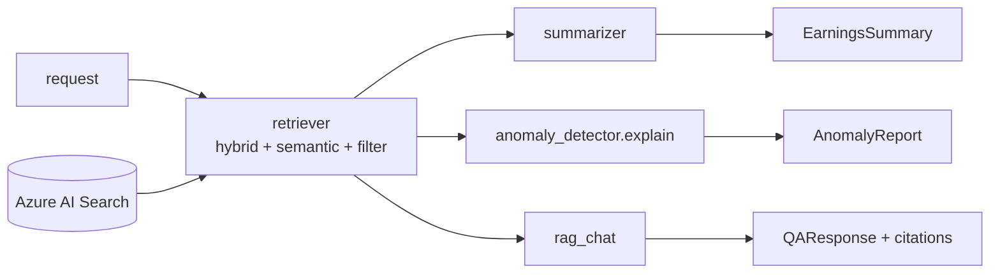

# Architecture

> **Note:** This all-Azure stack (Document Intelligence + AI Search + Azure OpenAI) is the
> **implemented** architecture. Two simplifications vs. the diagrams below: chunking is flat
> (section/table/figure, no parent-child), and the AI Search **semantic ranker** does the
> re-ranking (no separate reranker). See [`../CLAUDE.md`](../CLAUDE.md), [`../README.md`](../README.md),
> and [`../AZURE_SETUP.md`](../AZURE_SETUP.md).

## Diagrams

**System — ingest + query:**

Blue = Azure cloud (mocked in `MOCK_MODE`); gray = local Python. Ingest builds the AI Search
index; query reads it; all numbers are computed in Python (`math_guardrail`).

**A single `/chat` request:**

FinAssist is a RAG system specialized for multimodal financial filings. It has an **ingestion
path** (offline, builds the index) and a **query path** (online, answers requests).

## Components

| Layer | Module | Azure service | Responsibility |
|---|---|---|---|
| Parse | `ingestion/document_parser` | Document Intelligence (`prebuilt-layout`) | PDF → text + tables + figure regions |
| Tables | `ingestion/table_extractor` | — | DI tables → structured `FinancialTable` (raw cells + markdown) |
| Figures | `ingestion/figure_extractor` | PyMuPDF | crop chart regions → PNG |
| Vision | `multimodal/chart_describer` | Azure OpenAI (vision) | chart PNG → factual text description |
| Chunk | `chunking/chunker` | — | enriched content → `Chunk`s + metadata |
| Embed | `embeddings/embedder` | Azure OpenAI (embeddings) | chunk text → vectors |
| Index | `search/indexer` | Azure AI Search | write chunks + vectors |
| Retrieve | `search/retriever` | Azure AI Search | hybrid + semantic + filters → `RetrievedChunk`s |
| Summarize | `analysis/summarizer` | Azure OpenAI (chat) | structured `EarningsSummary` |
| Anomalies | `analysis/anomaly_detector` | Python + Azure OpenAI | compute deltas (Python) + explain (LLM) |
| Q&A | `qa/rag_chat` | Azure OpenAI (chat) | grounded answer + citations |
| Serve | `api/*`, `ui/*` | FastAPI / Streamlit | HTTP surface + demo |

## Ingestion path

## Query path

## Why these choices

- **Custom RAG, not "On Your Data".** Azure OpenAI's On Your Data feature is deprecated/retiring,
  and it hides chunking, filtering, and citation logic we need control over. We own the retriever.
- **Hybrid + semantic ranker.** Microsoft's benchmarking shows hybrid retrieval (BM25 + vector via
  Reciprocal Rank Fusion) re-ranked by the semantic L2 ranker beats vector-only relevance. Needs
  Standard tier+.
- **Numbers in Python, prose in the LLM.** Financial figures are extracted from tables and all
  deltas are computed deterministically. The model selects, organizes, and explains — it never
  originates a number. This is the core anti-hallucination guardrail.
- **Multimodal via description, not raw image retrieval.** Describing charts to text lets them flow
  through the same embed/index/retrieve/cite path as everything else, keeping the system simple.

## Citations

Every chunk stores `doc_id`, `page`, and `section`. Summaries, anomalies, and answers attach
`Citation` objects so any claim resolves back to an exact page/section of the source filing.

## Scope guardrail

Outputs describe what filings report. The system prompts forbid investment advice,
recommendations, and price targets. Company-stated guidance may be reported, with a citation.
